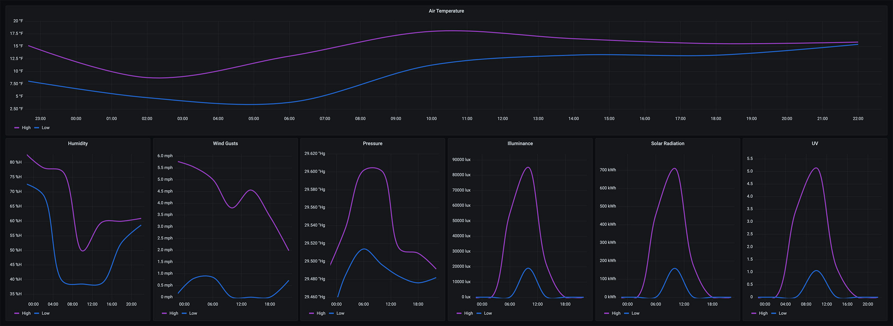
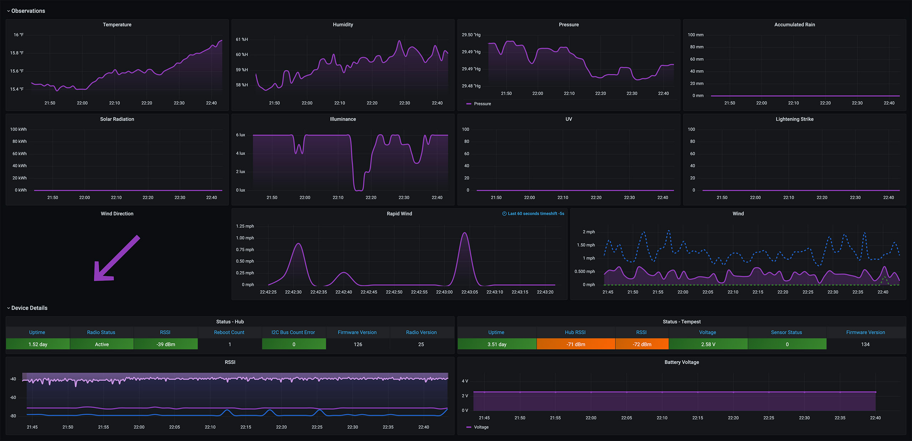

## grafana-weatherflow-udp-aio

## About The Project

This **Grafana WeatherFlow UDP All-In-One** example has been put together to help you get up and running quickly with a UDP collector to visualize your raw [WeatherFlow Tempest](https://weatherflow.com/tempest-weather-system/) metric stream. 

It takes the [UDP collector](https://github.com/vinceskahan/weatherflow-udp-listener) from [Vince Skahan](https://github.com/vinceskahan) and adds a pre-configured [Grafana](https://grafana.com/oss/grafana/) front-end (Dashboards) with an [InfluxDB](https://www.influxdata.com/products/influxdb/) backend (Database). 

## Getting Started

The project is built around a pre-configured Docker stack containing the following containers:

 - [Grafana](https://grafana.com/oss/grafana/)
 - [InfluxDB](https://www.influxdata.com/products/influxdb/)
 - [WeatherFlow UDP Collector](https://github.com/vinceskahan/weatherflow-udp-listener)

## Prerequisites

- [Docker](https://docs.docker.com/install)
- [Docker Compose](https://docs.docker.com/compose/install)

## Using

To get started, download the code from this repository and extract it into an empty directory. For example:

    wget https://github.com/lux4rd0/grafana-weatherflow-udp-aio/archive/main.zip
    unzip main.zip
    cd grafana-weatherflow-udp-aio
    
From that directory, run the docker-compose command:

    docker-compose -f docker-compose.yml up -d

This will start to download all of the needed application containers (Grafana and InfluxDB) and it builds the WeatherFlow UDP container.

*Note, this project is built and tested on Linux CentOS 7.* 

**Grafana Dashboards**

Once all of the docker containers are started up, point your Web browser to the Grafana page, typically http://hostname:3000/ - with hostname being the name of the server you ran the docker-compose up -d command on. The "**WeatherFlow - WeatherFlow (Details/Live)**" dashboard is defaulted without having to login.

*Note: this docker-compose stack is designed to be as easy as possible to deploy and go. Anonymous logins have been enabled and the default user has a **Viewer** role. This can be changed to either an **Admin** or **Editor** role by changing the Grafana environmental variable in the `docker-compose.yml` file to:*

    GF_AUTH_ANONYMOUS_ORG_ROLE: Viewer

## Downloading Grafana WeatherFlow Dashboards Individually

The dashboards included in this All In One can also be downloaded separately if so desired:

- [Weather - WeatherFlow (Details/Live)](https://grafana.com/grafana/dashboards/13858)
- [Weather - WeatherFlow Overview](https://grafana.com/grafana/dashboards/13857)

## Data Retention and Storage Locations

The data collected from the WeatherFlow UDP collector gets sent over to the InfluxDB database. The storage for that data is persisted into the deployed InfluxDB container. There are a few different ways to persist that data outside of the container, specifically by using volume mounts. I've added a second docker-compose configuration that can be used in this example:

    docker-compose -f docker-compose-datavolume.yml up -d

This uses the /data folder to store the InfluxDB data files. Update the `docker-compose-datavolume.yml` if you want to place it someplace else on your file system.
 
## Roadmap

See the open issues for a list of proposed features (and known issues).

## Contributing

Contributions are what make the open source community such an amazing place to be learn, inspire, and create. Any contributions you make are greatly appreciated.

- Fork the Project
- Create your Feature Branch (git checkout -b feature/AmazingFeature)
- Commit your Changes (git commit -m 'Add some AmazingFeature')
- Push to the Branch (git push origin feature/AmazingFeature)
- Open a Pull Request

## Contact

Dave Schmid - [@lux4rd0](https://twitter.com/lux4rd0) - dave@pulpfree.org
Project Link: https://github.com/lux4rd0/grafana-weatherflow-udp-aio

## Acknowledgements

- Grafana Labs - https://grafana.com/
- Grafana - https://grafana.com/oss/grafana/
- Grafana Dashboard Community - https://grafana.com/grafana/dashboards
